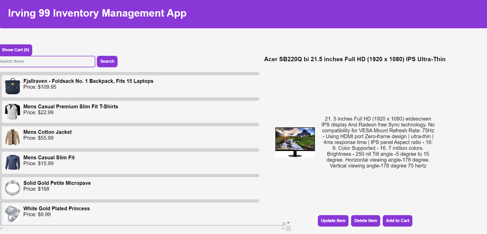

# Inventory Managment App

## Project Overview
This application built by Irving 99 aka The Best, displays a list of items in a box and allows users to view information about a selected item next to the box. Users can easily add and update items through interactive forms as well as delete a selected item with click of a button.

## Tech Stack
FrontEnd: React
Backend: Node.js, Express.js, Sequelize
Deployemnt: Render

## Installation
1. Clone the repository 
  `git clone https://github.com/irving-99/inventory-app.git
   cd inventory-app`
2. Install Dependencies
  `npm install`
  `npm run seed`
3. Start Development Servers
  `npm run server-dev`
   In a seperate terminal, 
  `npm run client-dev`
4. View Application on
   http://localhost:[port]

## Usage 
 -  Adding Items: Click the "Add Item" button, fill in the form, and click "Add" to save the item
 -  Updating Items: Select an item, click "Update Item", make changes in the pre-filled form, and click "Update". If you change your mind you can  click on the "Back" button to go back to the main view
 -  Delete Items: Select an item and click "Delete Item". The item will be removed from both the database and frontend view
 -  Search Items: Input the name of a particular item within the search box and the list will update with any items matching the text

## Contributers
  - Evan Rosas
  - Clement Ndimuangu
  - Kofi Boateng

## Deployment 
  The project will be displayed in Render. Once deployed, the live site link will be available [here]

<!-- 
### Tier I: MVP Application
- As a User, I want to view all items in inventory
  - Sequelize Model for Item
  - Name, Description, Price, Category, Image
  - Express Route to GET all Items
  - Front-end View for all Items
- As a User, I want to view any individual item
  - Express Route to GET one Item
  - Front-end view for one item (click to see)

### Tier II: Adding an Item
- As a User, I want to add an item by completing a form
  - Add Item front-end form
  - Express Route to ADD the Item
  - Form or Fetch request to add item when form is submitted

### Tier III: Deleting an Item
- As a User, I want to  remove an item from inventory
  - Delete button on Single Item View
  - Express Route to DELETE the Item
  - Fetch request to delete item when button is clicked

### Tier IV: Updating an Item
- As a User, I want to edit an item by filling a form
  - Edit form on Single Item View
  - Express Route to UPDATE the Item
  - Fetch request to update item when form is submitted

### Tier V: Bonus Stuff
- Models, Routes for Users and Orders
- As a User, I want my Inventory site to be visually stunning
- As a User, I want to be able to search through data based on search criteria
- As a User, I want to add items to a cart and purchase
- As a User, I want to use the application on a mobile browser
- As an Admin, I want all Add and Edit item requests to have server-side validations -->
